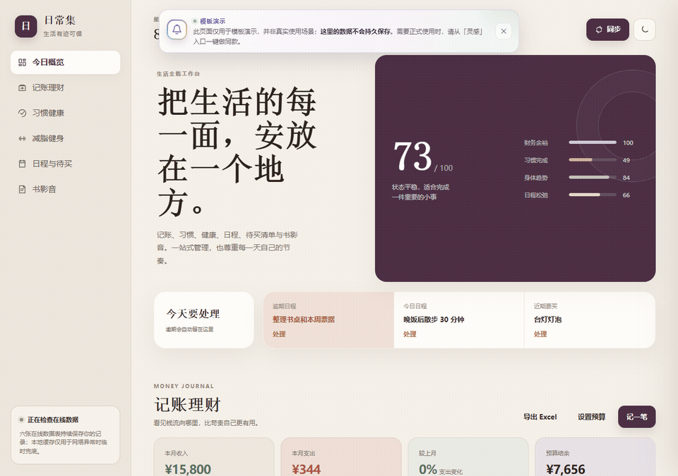

# workbench-builder

[](./LICENSE)


基于 **WorkBuddy 资料库** 构建可插拔、单文件交付的个人 / 团队工作台 Skill。

把用户的零散数据（待办、记忆、指标、笔记、链接、看板、账本、习惯……）聚合为一个**零依赖、单文件、可离线、可分享**的 HTML 工作台，并把所有持久化数据落到 WorkBuddy **资料库**的 CSV(database) 节点里。



> 演示动画来自 WorkBuddy 资料库官方示例工作台「生活工作台」（生活全能），自上而下滚动浏览。更多说明见 [`examples/usage-example.md`](./examples/usage-example.md)。

---

## 特性

- **14 个开箱即用模块**（按需勾选）：`todo` / `mem` / `dashboard` / `notes` / `links` / `kanban` / `calendar` / `ledger` / `habits` / `reading` / `contacts` / `inventory` / `journal` / `news`
- **4 套 UI 模板**：`sidebar`（侧边栏）/`cardGrid`（卡片网格）/`topnav`（顶部导航）/`masonry`（瀑布流），深 / 浅色主题
- **5 套全局 UI 风格预设**：`default`（云灰蓝）/`macaron`（马卡龙）/`ink`（墨韵）/`ocean`（深海）/`sunset`（晚霞），切换全局生效，图表/模块同步跟随
- **6+ 模板示例**：内置组合 + 从 GitHub 优秀项目汲取灵感的导航启动页、玻璃仪表盘、质感起始页等（均改写为同一 token 系统、零依赖）
- **强制资料库 CSV 落库**：工作台 HTML 是视图 + 运行时编辑层（localStorage 暂存），CSV 导入 / 导出做同步；最终交付是资料库「我的文档」里的在线 page + database 节点
- **每日信息源自动更新**：对 `news` / `links` / 外部驱动的 `dashboard` 等动态模块，自动配置 `automation_update` 每日定时把最新数据写回资料库 CSV
- **交付前自动化验收**：六维质量门（UI 交互逻辑 / 样式配色 / 布局完整度 / 数据结构 / 设计一致性 / 自动化任务符合预期），配套 Check List 与 Test Case

## 安装

把本仓库放到 WorkBuddy 的 skills 目录即可（二选一）：

```bash
# 用户级（跨项目复用，推荐）
git clone https://github.com/little-apppple/workbuddy_workbench_builder.git ~/.workbuddy/skills/workbench-builder

# 或项目级（仅当前项目）
git clone https://github.com/little-apppple/workbuddy_workbench_builder.git <workspace>/.workbuddy/skills/workbench-builder
```

## 使用

在 WorkBuddy 中直接说，例如：

> 搭个工作台 / 做个个人面板 / 用资料库建仪表盘 / 每天自动更新工作台数据

Skill 会按五步流程执行：

1. **存量数据确认** —— 导入 CSV / Excel / 微信文档 / 飞书 / 腾讯文档等
2. **需求板块确认** —— 从模块目录勾选要包含的模块
3. **UI 规范确认** —— 选择模板、风格与主题
4. **生成并交付到资料库「我的文档」** —— 产出单文件内联 HTML + 各模块 CSV 落库（强制终态）
5. **每日信息源自动更新** —— 按需自动配置定时任务

> 交付终态 = 资料库节点：单文件内联 HTML 作为在线 **page** 节点、各模块数据作为 **CSV(database)** 节点，二者默认都落「我的文档」。本地 HTML 仅作为生成中间产物。

## 目录结构

```
workbench-builder/
├── SKILL.md                      # 主流程与约束（权威说明）
├── examples/
│   ├── reference-workbench.html     # 权威交付种子（已内联 14 模块 + 4 模板 + 5 风格）
│   ├── style-gallery.html           # 5 套 UI 风格预设预览器
│   ├── templates/                   # 完整模板示例（预设/布局组合 + 外部灵感改写）
│   │   ├── macaron-masonry.html
│   │   ├── ocean-sidebar.html
│   │   ├── ink-topnav.html
│   │   ├── launchpad.html           # 导航型工作台（灵感：NavHub）
│   │   ├── glass-dashboard.html     # 玻璃拟态仪表盘（灵感：ZASENJC/dashboard）
│   │   └── textured-startpage.html  # 质感可换起始页（灵感：snownico0722/index-main）
│   ├── official-cases.md            # 资料库官方案例 → 模块组合映射
│   ├── usage-example.md             # 使用示例 + 分步截图说明
│   ├── preview.png                  # 静态界面预览
│   └── demo.gif                     # 4 套模板 + 深色主题动态演示
├── assets/
│   ├── deploy/
│   │   ├── deploy_to_library.py  # 一键建库 + 灌数 + 上传 HTML
│   │   └── manifest.json         # 模块 schema / seed 定义
│   └── ui/                       # 4 套布局 / 视觉骨架参考（非交付种子）
│       ├── sidebar.html
│       ├── card-grid.html
│       ├── topnav-tabs.html
│       └── masonry.html
├── references/
│   ├── module-catalog.md         # 14 模块字段定义
│   ├── ui-design-system.md       # UI 模板 + 风格预设规范
│   ├── checklist.md              # 交付前 Check List（P0/P1/P2）
│   └── test-cases.md             # 六维验收 Test Case + 报告模板
└── LICENSE
```

## 扩展

- **新增模块**：在 `reference-workbench.html` 的 `MODULE_REGISTRY` 增加一项 `{type,title,icon,schema,seed,render}`，并把 type 加入 `WORKBENCH_CONFIG.modules`；CSV 导入 / 导出复用全局共享的 `toCSV(rows, schema)`。
- **新增 UI 模板**：在 `UI_LAYOUTS` 增加布局函数 + 对应 CSS（用 CSS 变量，勿写死颜色）。

## 许可证

[MIT](./LICENSE)
