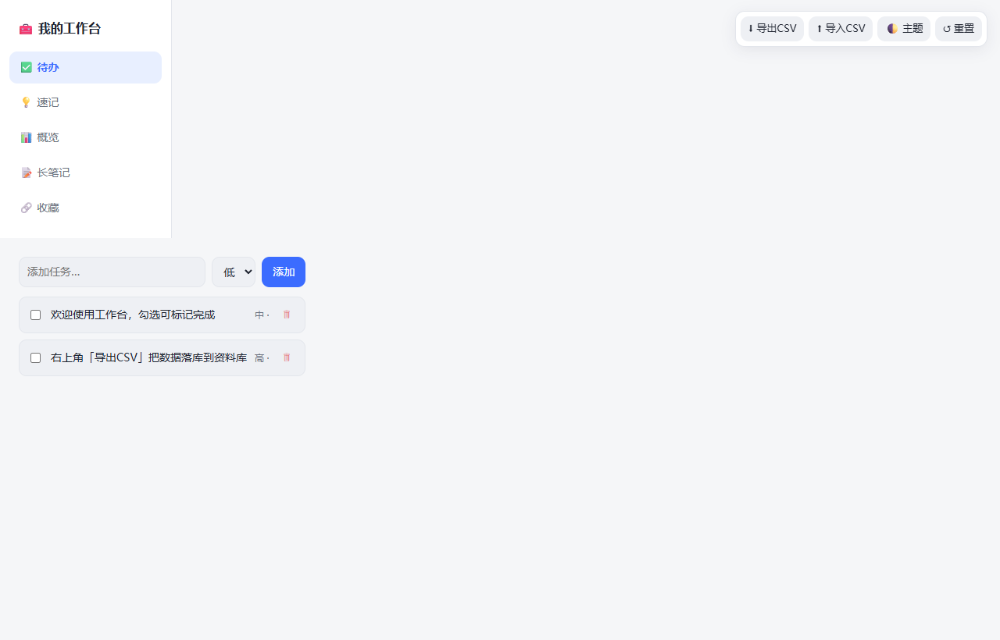

# 工作台使用示例（官方示例）

下面以 WorkBuddy 资料库官方的 **「生活工作台」**（生活全能）为例，展示一个真实、精致的工作台长什么样。

> 静态预览（首屏）



> 动态演示：自上而下滚动浏览完整工作台


## 这个工作台包含什么

官方「生活工作台」把生活的多个面整合在一处：

- **今日概览** —— 当日状态、财务余裕、习惯完成度等一眼可览的仪表
- **记账理财** —— 收支记录与财务余裕指标
- **习惯健康 / 减脂健身** —— 习惯打卡与身体数据追踪
- **日程与待买** —— 日程安排与待购清单
- **书影音** —— 读书 / 影视 / 音乐收藏

数据以「在线数据表」持续保存（资料库 CSV 节点），本地缓存仅用于网络异常时临时兜底——这正是本 skill 的存储设计理念：**资料库为权威源，本地 HTML 只是视图 + 运行时编辑层**。

## 想搭一个自己的工作台？

「生活工作台」是官方用本 skill 同款能力搭出来的范例。你可以用本仓库自带的能力，快速生成属于自己（或团队）的工作台：

1. 打开种子文件 `examples/reference-workbench.html`，按需要修改顶部的 `WORKBENCH_CONFIG`：
   - `modules`：从 `references/module-catalog.md` 的 15 个模块中勾选
   - `ui`：切换 `sidebar` / `cardGrid` / `topnav` / `masonry` 四套模板
   - `theme`：选择 `light` / `dark` / `auto`
2. 在浏览器里即可直接交互（新增 / 删除 / 编辑、导出 CSV、切换主题）。
3. 运行编排脚本，把数据落到资料库「我的文档」并生成在线 page：

   ```bash
   cd workbench-builder
   WB_TOKEN="<your-token>" python assets/deploy/deploy_to_library.py
   ```

完整流程见 [`SKILL.md`](../SKILL.md)。
